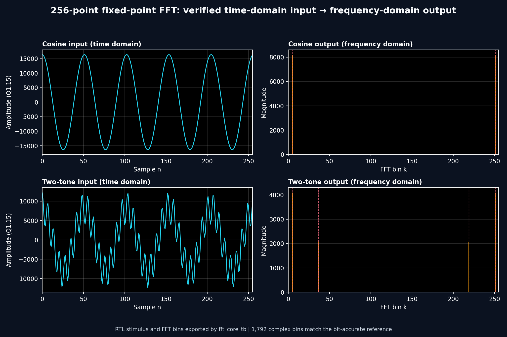
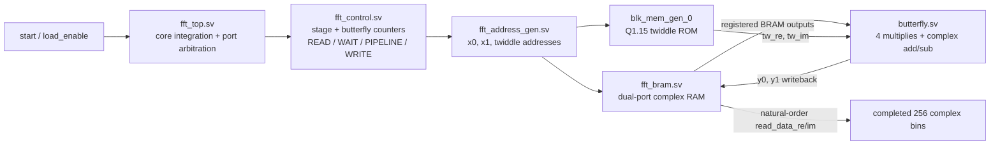
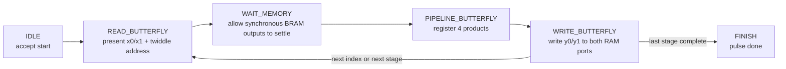
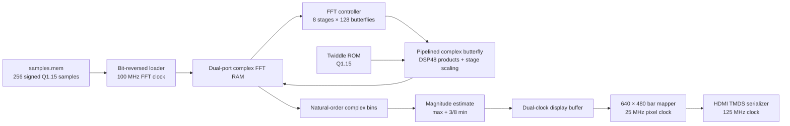

# 256-Point Fixed-Point FFT Spectrum Visualizer

A hardware spectrum analyzer for the RealDigital Urbana FPGA board. The design loads 256 signed samples, computes an in-place radix-2 FFT in SystemVerilog, estimates the magnitude of every frequency bin, and renders the spectrum as a 640 x 480 HDMI bar graph.

This was developed by Kartik Pidaparthi and Kyle Stadler as a final project for ECE 385: Digital Systems Laboratory at the University of Illinois Urbana-Champaign. This standalone repository is the cleaned, reproducible portfolio release.



*The paired panels use the exact samples and bins exported by the self-checking RTL regression: time-domain stimulus on the left, frequency-domain magnitude on the right. Across all seven test cases, all 1,792 complex output bins matched the bit-accurate Python model exactly.*

## Project status

The checked-in design is a verified educational FPGA release, not just an archived class demo. The FFT core, board controller, display mapping, implementation timing, and bitstream generation all have reproducible checks.

| Check | Result |
| --- | --- |
| Numerical FFT regression | 7 signal classes; 1,792 complex bins matched exactly |
| Inputs covered | DC, impulse, real tone, complex tone, two-tone, full-scale Nyquist, deterministic complex noise |
| Board pipeline | 2 consecutive transforms; all 512 loads and 512 display writes checked |
| Signed edge cases | Correct magnitude handling for `-32768 + j0` and `-32768 - j32768` |
| Display pipeline | Bin mapping, scaling, blanking, marker color, and video-control alignment checked |
| Spartan-7 implementation | Fully routed; 0 routing errors; 0 methodology violations; bitstream generated |
| Post-route timing | Worst setup slack `+1.017 ns`; worst hold slack `+0.108 ns` |

Vivado reports nine `DPIP-1` recommendations for optional additional DSP input registers. These are performance suggestions rather than correctness failures; the implemented design meets its 100 MHz and 25 MHz timing requirements with positive slack.

## Contributions

### Kartik Pidaparthi

I owned the FFT compute path and its verification:

- designed the radix-2 FFT architecture and scaled the original 8-point core to 256 points;
- implemented the complex Q1.15 butterfly, address generation, dual-port complex memory, and control FSM;
- integrated the twiddle-factor ROM and per-stage overflow control;
- debugged memory scheduling, fixed-point widths, output ordering, and pipeline alignment;
- built the self-checking SystemVerilog regression and bit-accurate Python reference model; and
- hardened the extracted portfolio design through board-pipeline tests and post-route timing signoff.

### Kyle Stadler

Kyle led much of the original board-facing integration: sample delivery, frame control, magnitude-to-bar conversion, the display buffer, VGA timing, HDMI output, board constraints, and display tuning.

For the live hardware demo, Kyle built push-button controls around a real-time sine-wave source. The buttons changed the generated signal while time-domain samples continuously passed through the FFT and produced a physical spectrum on the display. He also demonstrated a low-to-high frequency sweep; as the input frequency increased, the dominant output moved from the low bins toward the high bins as expected.

The standalone portfolio build uses `data/samples.mem` as a deterministic input so anyone can reproduce the results without the original live control hardware. Kyle's button-driven source and sweep describe the integrated team demo rather than a separate input peripheral included in this repository.

## FFT core architecture

This is the part of the project I owned: a reusable, in-place 256-point radix-2 FFT engine. `fft_top.sv` connects the control, address, memory, twiddle, and arithmetic blocks. The board/display logic consumes the completed bins afterward; it is intentionally outside this core-focused view.



The input load happens while `busy=0`; the controller then reuses the same two RAM ports for every butterfly. Bit-reversed input addresses make the eight-stage DIT schedule finish in natural bin order, so no second output permutation is needed. The twiddle address is generated from the stage and butterfly offset, while the two data addresses identify the butterfly pair.

### The four-cycle butterfly transaction

The controller deliberately separates synchronous BRAM access from the registered arithmetic pipeline. That is the key timing and correctness boundary in the FFT core:



Inside `butterfly.sv`, the four signed Q1.15 products are kept at full width. The real and imaginary products are combined, shifted back to Q1.15, and each output is divided by two. Eight stages therefore apply an overall `1/256` scale factor; the final values are saturated to signed 16-bit range. This explicit pipeline avoids a BRAM-to-DSP-to-BRAM critical path at the 100 MHz FFT clock.

### Core file design

| File | Core responsibility |
| --- | --- |
| `rtl/fft_top.sv` | Top-level FFT wiring, load/read arbitration, and connections between control, address, RAM, ROM, and butterfly |
| `rtl/fft_control.sv` | Six-state transaction FSM; advances the stage and butterfly index and generates `busy`, `write_enable`, and `done` |
| `rtl/fft_address_gen.sv` | Computes the two in-place data addresses and the stage-dependent twiddle address |
| `rtl/fft_bram.sv` | Synchronous dual-port complex sample memory used for in-place reads and writes |
| `rtl/butterfly.sv` | Registered complex multiply, add/subtract, per-stage scaling, and signed saturation |
| `ip/blk_mem_gen_0/blk_mem_gen_0.xci` | Vivado block-memory configuration for the twiddle ROM initialized from `data/twiddle256_q15.coe` |
| `dv/fft_core_tb.sv` | Self-checking core regression; exports every input sample and complex output bin |
| `scripts/verify_fft.py` | Bit-accurate Python reference model and exact CSV comparison |

## Board data path (context)



The downstream board path starts with the completed natural-order bins from the core above. The magnitude stage crosses into the display clock domain, maps the 256 values across the active video width, and sends the resulting bars through the HDMI TMDS transmitter.

The board controller approximates complex magnitude as:

```text
|X[k]| ~= max(|re|, |im|) + 3/8 * min(|re|, |im|)
```

The approximation uses shifts and addition around a pipelined datapath. The resulting 256 magnitudes cross into a dual-clock display buffer. The renderer maps all 640 active pixels exactly across bins 0 through 255, aligns video control signals with RAM latency, and sends the RGB stream through the HDMI TMDS transmitter.

## Key engineering findings

The original prototype could complete a transform and display a moving peak, but its simplest simulated inputs exposed incorrect bin data. Verification isolated four interacting causes:

- FFT reads and write-backs competed for the same memory ports, allowing stale operands into later butterflies;
- overextended operands created oversized multiplication results that were silently truncated;
- the registered twiddle ROM and DSP products needed explicit controller pipeline states; and
- output reads were bit-reversed a second time even though bit-reversed input already produced natural-order output.

The board path also dropped the final input sample and wrote delayed magnitudes to the wrong display addresses. The corrected design uses deterministic read/settle/pipeline/write scheduling, width-safe fixed-point arithmetic, an aligned four-cycle result pipeline, and synchronous BRAM-facing resets. Those behaviors are now locked down by self-checking tests.

## Repository layout

| Path | Contents |
| --- | --- |
| `rtl/` | Synthesizable SystemVerilog for the FFT, controller, and display path |
| `dv/` | Self-checking core, board-pipeline, and display testbenches |
| `data/` | Deterministic input samples and Q1.15 twiddle coefficients |
| `constraints/` | Urbana clock, reset, HDMI pin, and interface constraints |
| `ip/` | Vivado configurations for the twiddle ROM, clock wizard, and HDMI transmitter |
| `third_party/` | Bundled RealDigital HDMI transmitter IP |
| `scripts/` | Batch verification, implementation, and plotting tools |
| `assets/` | Testbench-generated output figure used above |
| `FFT_Project.xpr` | Vivado 2022.2 project file |

Vivado caches, generated IP products, run directories, simulation databases, reports, checkpoints, and bitstreams are intentionally ignored. They are reproducible from the tracked sources.

## Reproducing the results

Requirements:

- AMD/Xilinx Vivado 2022.2
- Python 3
- Matplotlib, only for regenerating the output figure
- RealDigital Urbana board for physical HDMI output; simulation and implementation do not require the board

Run commands from the repository root.

### Exact FFT regression

```powershell
powershell -ExecutionPolicy Bypass -File scripts/run_verify.ps1
```

This runs XSim, exports every real and imaginary bin, and compares all seven transforms against `scripts/verify_fft.py`. Any mismatch returns a failure.

### Board and display simulations

```powershell
vivado -mode batch -source scripts/run_board_sim.tcl
```

This checks repeated transforms, sample/address alignment, magnitude writes, signed corner cases, pixel-to-bin mapping, bar scaling, blanking, and control-signal latency.

### Full implementation and bitstream

```powershell
vivado -mode batch -source scripts/run_impl.tcl
```

The script synthesizes, optimizes, places, routes, checks setup and hold slack, generates DRC/CDC/methodology/utilization reports, writes a routed checkpoint, and produces `build/fft_visualizer.bit`. It exits with an error for negative timing slack or severe implementation violations.

### Regenerate the figure

After running the exact FFT regression:

```powershell
python scripts/plot_fft_results.py
```

The plotter reads `fft_inputs.csv` and `fft_bins.csv` from the XSim run directory, so the figure always reflects the same RTL stimulus and output bins that the reference checker just validated. Generate the figure before running the board/display simulation, because Vivado resets the shared simulation directory when it launches a different testbench.

To test another deterministic signal, replace `data/samples.mem` with 256 signed 16-bit hexadecimal samples, one per line, then rerun simulation or implementation.

## Third-party IP

The HDMI/DVI encoder under `third_party/hdmi_tx_1.0/` is by Tinghui Wang / RealDigital.org and is distributed under BSD 3-Clause terms included in its source headers. The other configured IP blocks are generated by Vivado.
